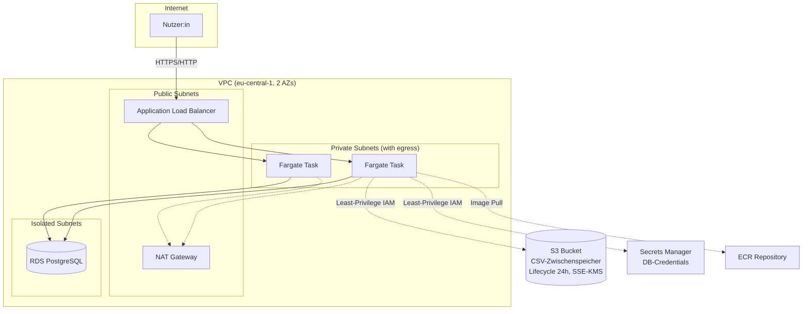

# WebSurface — AWS Infrastructure-as-Code (CDK)

Diese Infrastruktur ist als **Portfolio-/Lernnachweis** entstanden — Fokus
liegt bewusst auf **Kern-Compute & Netzwerk** (VPC, Security Groups,
Application Load Balancer, ECS/Fargate mit Auto Scaling). RDS, S3 und IAM
sind in einfacherer Tiefe mitgebaut, da eine lauffähige Architektur ohne
Datenschicht keinen Sinn ergibt.

**Es wurde nichts deployed** (`cdk deploy` wurde nicht ausgeführt — in
dieser Entwicklungsumgebung sind keine AWS-Zugangsdaten hinterlegt). Ziel
ist reviewbarer, syntaktisch validierter (`cdk synth`) Code, kein laufendes
System.

## Architektur



## Stacks

| Stack | Datei | Inhalt |
|---|---|---|
| `WebSurfaceNetworkStack` | `lib/network-stack.ts` | VPC (2 AZs, 3 Subnetz-Ebenen), Security Groups (ALB → ECS → RDS, Least-Privilege-Kette) |
| `WebSurfaceDataStack` | `lib/data-stack.ts` | RDS Postgres (isoliertes Subnetz), S3-Bucket für CSV-Zwischenspeicher (SSE-KMS, 24h-Lifecycle) |
| `WebSurfaceComputeStack` | `lib/compute-stack.ts` | ECS-Cluster, Fargate-Service (2–6 Tasks, CPU-Auto-Scaling), ALB, ECR-Repository, getrennte Task-/Execution-IAM-Rollen |

Siehe auch [`lib/amplify-alternative.md`](./lib/amplify-alternative.md) für
die bewusste Abwägung ECS/Fargate vs. AWS Amplify Hosting.

## Bewusste Design-Entscheidungen (mit Trade-offs)

- **1 NAT Gateway statt 2** — spart laufende Kosten, opfert AZ-Redundanz für
  ausgehenden Traffic der privaten Subnetze. Für Produktivbetrieb mit
  hohen Verfügbarkeitsanforderungen: `natGateways: 2`.
- **Kein HTTPS-Listener/ACM-Zertifikat** — es existiert keine reale Domain
  für dieses Portfolio-Projekt. Der ALB-Listener läuft auf Port 80; in
  Produktion käme ein ACM-Zertifikat + 443-Listener + 80→443-Redirect dazu.
- **`RemovalPolicy.DESTROY` bei RDS/S3** — ermöglicht sauberen Abbau des
  Stacks für Demo-Zwecke. Bei echten Kundendaten wäre `RETAIN` +
  automatisierte Snapshots Pflicht.
- **Kein reales Container-Image** — das ECR-Repository ist als Platzhalter
  für den CI/CD-Schritt `docker build && push` angelegt; dieser Schritt ist
  nicht Teil dieses Prototyps.

Diese Punkte wurden im Konzeptdokument von der simulierten CIO-Review
explizit aufgegriffen und sind dort mit der jeweiligen Begründung
kommentiert.

## Verifikation (ohne Deployment)

```bash
npm install
npm run build     # TypeScript-Kompilierung
npm test          # CDK-Assertions (test/network-stack.test.ts)
npm run synth      # erzeugt gültiges CloudFormation-Template in cdk.out/
```

`npm run synth` ist der entscheidende Nachweis: Er erzeugt ein
vollständiges, gültiges CloudFormation-Template, ohne dass AWS-Zugangsdaten
oder ein Deployment nötig sind.
